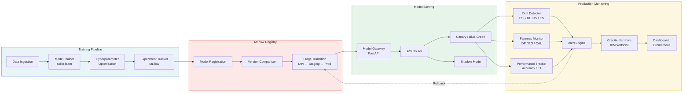
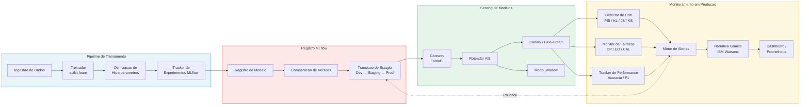

# Watsonx MLOps Model Monitor

[](https://www.python.org/)
[](https://www.ibm.com/watsonx)
[](https://mlflow.org/)
[](https://scikit-learn.org/)
[](https://fastapi.tiangolo.com/)
[](https://kubernetes.io/)
[](LICENSE)
[](.github/workflows/ci.yml)

---

**[English](#english)** | **[Portugues](#portugues)**

---

## English

### Overview

Enterprise-grade MLOps platform integrating **IBM Watsonx** for end-to-end model lifecycle management. The system provides automated drift detection using four complementary statistical tests (PSI, KL-divergence, Jensen-Shannon, Kolmogorov-Smirnov), fairness auditing with demographic parity and equalized odds metrics, intelligent model serving with A/B testing and canary deployments, and IBM Granite-powered monitoring narratives for human-readable alert reports.

### Features

| Category | Feature | Description |
|---|---|---|
| **Monitoring** | Drift Detection | PSI, KL-divergence, JS-distance, KS-test with configurable thresholds |
| **Monitoring** | Fairness Audit | Demographic parity, equalized odds, calibration across protected groups |
| **Monitoring** | Performance Tracking | Sliding-window accuracy, F1, precision, recall with degradation alerts |
| **Monitoring** | Alert Engine | Severity-based alerts with cooldowns, deduplication, and Prometheus export |
| **Training** | ML Pipeline | scikit-learn pipelines with Logistic Regression, Random Forest, Gradient Boosting |
| **Training** | Experiment Tracking | MLflow integration for parameters, metrics, and artifact logging |
| **Training** | Hyperparameter Optimization | GridSearchCV with automated best-parameter retraining |
| **Registry** | Model Registry | MLflow Model Registry with versioning, stage transitions, and rollback |
| **Registry** | Version Comparison | Automated A/B metric comparison with promotion recommendations |
| **Serving** | Model Gateway | Centralized inference endpoint with multi-model management |
| **Serving** | A/B Router | Canary, blue-green, shadow, and direct routing strategies |
| **Serving** | Shadow Mode | Side-by-side candidate evaluation without user impact |
| **Governance** | Granite Narratives | IBM Granite LLM generates human-readable monitoring reports |

### Architecture



### Tech Stack

| Layer | Technology |
|---|---|
| AI Platform | IBM Watsonx AI, IBM Granite 13B |
| ML Framework | scikit-learn, NumPy, SciPy |
| Experiment Tracking | MLflow |
| API | FastAPI, Uvicorn |
| UI | Streamlit |
| Metrics | Prometheus Client |
| Configuration | Pydantic Settings, PyYAML |
| Logging | structlog |
| Containerization | Docker, Docker Compose |
| Orchestration | Kubernetes |
| CI/CD | GitHub Actions |
| Language | Python 3.10+ |

### Quick Start

#### Prerequisites

- Python 3.10+
- Docker and Docker Compose
- IBM Cloud account with Watsonx AI access (for Granite narratives)

#### Local Development

```bash
# Clone the repository
git clone https://github.com/galafis/watsonx-mlops-model-monitor.git
cd watsonx-mlops-model-monitor

# Create virtual environment
python -m venv venv
source venv/bin/activate  # Linux/Mac
# venv\Scripts\activate   # Windows

# Install dependencies
pip install -r requirements.txt
pip install -r requirements-dev.txt

# Configure environment
cp .env.example .env
# Edit .env with your IBM Watsonx credentials

# Run tests
make test

# Start MLflow server
make run-mlflow
```

#### Docker

```bash
# Build and start all services
make docker-build
make docker-up

# Services:
#   MLflow UI:   http://localhost:5000
#   FastAPI:     http://localhost:8080
#   Streamlit:   http://localhost:8501

# Stop services
make docker-down
```

#### Kubernetes Deployment

```bash
# Create secrets
kubectl create secret generic watsonx-secrets \
  --from-literal=api-key=YOUR_WATSONX_API_KEY \
  --from-literal=project-id=YOUR_WATSONX_PROJECT_ID

# Deploy
kubectl apply -f k8s/deployment.yaml
kubectl apply -f k8s/service.yaml

# Verify
kubectl get pods -l app=watsonx-mlops-monitor
```

### Project Structure

```
watsonx-mlops-model-monitor/
├── src/
│   ├── __init__.py
│   ├── config.py                  # Pydantic settings + YAML config loader
│   ├── monitoring/
│   │   ├── __init__.py
│   │   ├── drift_detector.py      # PSI, KL, JS, KS drift tests
│   │   ├── fairness_monitor.py    # Demographic parity, equalized odds
│   │   ├── performance_tracker.py # Sliding-window metric tracking
│   │   └── alert_engine.py        # Alert management with cooldowns
│   ├── training/
│   │   ├── __init__.py
│   │   ├── trainer.py             # scikit-learn training pipeline
│   │   ├── experiment.py          # MLflow experiment tracking
│   │   └── hyperopt.py            # GridSearchCV optimization
│   ├── registry/
│   │   ├── __init__.py
│   │   ├── model_registry.py      # MLflow Model Registry operations
│   │   └── versioning.py          # Version comparison and promotion
│   └── serving/
│       ├── __init__.py
│       ├── gateway.py             # Model inference gateway
│       ├── ab_router.py           # A/B, canary, blue-green routing
│       └── shadow_mode.py         # Shadow deployment runner
├── tests/
│   ├── __init__.py
│   ├── test_drift_detector.py
│   ├── test_fairness_monitor.py
│   ├── test_training.py
│   ├── test_serving.py
│   └── test_registry.py
├── notebooks/
│   └── 01_mlops_demo.ipynb
├── docs/
│   └── architecture.md
├── config/
│   └── settings.yaml
├── k8s/
│   ├── deployment.yaml
│   └── service.yaml
├── .github/
│   └── workflows/
│       └── ci.yml
├── Dockerfile
├── docker-compose.yml
├── Makefile
├── pyproject.toml
├── requirements.txt
├── requirements-dev.txt
├── .env.example
├── .gitignore
└── LICENSE
```

### Usage Examples

#### Drift Detection

```python
from src.monitoring.drift_detector import DriftDetector
import numpy as np

detector = DriftDetector(psi_threshold=0.2, n_bins=10)

reference = np.random.normal(0, 1, (1000, 3))
production = np.random.normal(0.5, 1.2, (1000, 3))

report = detector.detect(reference, production, ["age", "income", "score"])

for result in report.feature_results:
    if result.is_drifted:
        print(f"{result.feature_name}: PSI={result.psi:.4f}, severity={result.severity.value}")
```

#### Fairness Monitoring

```python
from src.monitoring.fairness_monitor import FairnessMonitor
import numpy as np

monitor = FairnessMonitor(dp_threshold=0.1)

y_true = np.array([1, 0, 1, 1, 0, 1, 0, 0])
y_pred = np.array([1, 0, 1, 0, 0, 1, 1, 0])
groups = {"gender": np.array(["M", "M", "F", "F", "M", "F", "M", "F"])}

report = monitor.evaluate(y_true, y_pred, groups)
print(f"Fair: {report.overall_fair}, Violations: {report.n_violations}")
```

#### Model Training and Serving

```python
from src.training.trainer import ModelTrainer
from src.serving.gateway import ModelGateway
from src.serving.ab_router import ABRouter, RoutingConfig, RoutingStrategy

# Train
trainer = ModelTrainer(algorithm="random_forest")
result = trainer.train(X_train, y_train)

# Serve
gateway = ModelGateway()
gateway.load_model("production", result.model)

# Route with canary
config = RoutingConfig(strategy=RoutingStrategy.CANARY, canary_weight=0.1)
router = ABRouter(gateway, config=config)
prediction = router.route([[1.0, 2.0, 3.0]])
```

### Author

**Gabriel Demetrios Lafis**

- GitHub: [galafis](https://github.com/galafis)
- LinkedIn: [gabriel-demetrios-lafis](https://www.linkedin.com/in/gabriel-demetrios-lafis)

### License

This project is licensed under the MIT License - see the [LICENSE](LICENSE) file for details.

---

## Portugues

### Visao Geral

Plataforma MLOps de nivel empresarial integrando **IBM Watsonx** para gestao completa do ciclo de vida de modelos. O sistema oferece deteccao automatizada de drift usando quatro testes estatisticos complementares (PSI, divergencia KL, Jensen-Shannon, Kolmogorov-Smirnov), auditoria de fairness com metricas de paridade demografica e odds equalizadas, serving inteligente de modelos com testes A/B e deploys canary, e narrativas de monitoramento geradas pelo IBM Granite para relatorios de alerta legiveispor humanos.

### Funcionalidades

| Categoria | Funcionalidade | Descricao |
|---|---|---|
| **Monitoramento** | Deteccao de Drift | PSI, divergencia KL, distancia JS, teste KS com thresholds configuraveis |
| **Monitoramento** | Auditoria de Fairness | Paridade demografica, odds equalizadas, calibracao entre grupos protegidos |
| **Monitoramento** | Tracking de Performance | Acuracia, F1, precisao, recall em janela deslizante com alertas de degradacao |
| **Monitoramento** | Motor de Alertas | Alertas baseados em severidade com cooldowns, deduplicacao e export Prometheus |
| **Treinamento** | Pipeline de ML | Pipelines scikit-learn com Regressao Logistica, Random Forest, Gradient Boosting |
| **Treinamento** | Tracking de Experimentos | Integracao MLflow para parametros, metricas e logging de artefatos |
| **Treinamento** | Otimizacao de Hiperparametros | GridSearchCV com retreinamento automatizado dos melhores parametros |
| **Registro** | Registro de Modelos | MLflow Model Registry com versionamento, transicoes de estagio e rollback |
| **Registro** | Comparacao de Versoes | Comparacao automatica de metricas A/B com recomendacoes de promocao |
| **Serving** | Gateway de Modelos | Endpoint centralizado de inferencia com gerenciamento multi-modelo |
| **Serving** | Roteador A/B | Estrategias de roteamento canary, blue-green, shadow e direto |
| **Serving** | Modo Shadow | Avaliacao lado a lado do candidato sem impacto ao usuario |
| **Governanca** | Narrativas Granite | IBM Granite LLM gera relatorios de monitoramento legiveis por humanos |

### Arquitetura



### Stack Tecnologico

| Camada | Tecnologia |
|---|---|
| Plataforma de IA | IBM Watsonx AI, IBM Granite 13B |
| Framework de ML | scikit-learn, NumPy, SciPy |
| Tracking de Experimentos | MLflow |
| API | FastAPI, Uvicorn |
| Interface | Streamlit |
| Metricas | Prometheus Client |
| Configuracao | Pydantic Settings, PyYAML |
| Logging | structlog |
| Containerizacao | Docker, Docker Compose |
| Orquestracao | Kubernetes |
| CI/CD | GitHub Actions |
| Linguagem | Python 3.10+ |

### Inicio Rapido

#### Pre-requisitos

- Python 3.10+
- Docker e Docker Compose
- Conta IBM Cloud com acesso ao Watsonx AI (para narrativas Granite)

#### Desenvolvimento Local

```bash
# Clonar o repositorio
git clone https://github.com/galafis/watsonx-mlops-model-monitor.git
cd watsonx-mlops-model-monitor

# Criar ambiente virtual
python -m venv venv
source venv/bin/activate  # Linux/Mac
# venv\Scripts\activate   # Windows

# Instalar dependencias
pip install -r requirements.txt
pip install -r requirements-dev.txt

# Configurar ambiente
cp .env.example .env
# Editar .env com suas credenciais IBM Watsonx

# Executar testes
make test

# Iniciar servidor MLflow
make run-mlflow
```

#### Docker

```bash
# Construir e iniciar todos os servicos
make docker-build
make docker-up

# Servicos:
#   MLflow UI:   http://localhost:5000
#   FastAPI:     http://localhost:8080
#   Streamlit:   http://localhost:8501

# Parar servicos
make docker-down
```

#### Deploy no Kubernetes

```bash
# Criar secrets
kubectl create secret generic watsonx-secrets \
  --from-literal=api-key=SUA_CHAVE_API_WATSONX \
  --from-literal=project-id=SEU_PROJECT_ID_WATSONX

# Deploy
kubectl apply -f k8s/deployment.yaml
kubectl apply -f k8s/service.yaml

# Verificar
kubectl get pods -l app=watsonx-mlops-monitor
```

### Autor

**Gabriel Demetrios Lafis**

- GitHub: [galafis](https://github.com/galafis)
- LinkedIn: [gabriel-demetrios-lafis](https://www.linkedin.com/in/gabriel-demetrios-lafis)

### Licenca

Este projeto esta licenciado sob a Licenca MIT - veja o arquivo [LICENSE](LICENSE) para detalhes.
