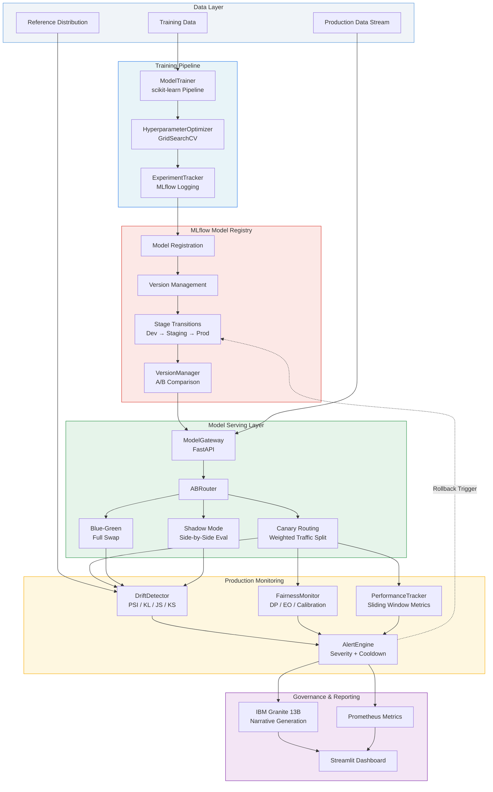

# Architecture - Watsonx MLOps Model Monitor

## Overview

The Watsonx MLOps Model Monitor is an enterprise-grade platform for end-to-end model lifecycle management. It integrates IBM Watsonx AI for intelligent monitoring narratives with a robust scikit-learn training pipeline, MLflow experiment tracking and model registry, FastAPI model serving with advanced routing strategies, and comprehensive production monitoring.

## System Architecture



## Component Details

### 1. Training Pipeline

The training subsystem provides a standardized interface for model development.

**ModelTrainer** (`src/training/trainer.py`)
- Builds scikit-learn `Pipeline` with `StandardScaler` + classifier
- Supports three algorithms: Logistic Regression, Random Forest, Gradient Boosting
- Automated train/test split with stratification
- Computes accuracy, F1, precision, recall, ROC-AUC
- Cross-validation with configurable fold count

**HyperparameterOptimizer** (`src/training/hyperopt.py`)
- Wraps scikit-learn `GridSearchCV` with predefined parameter grids
- Parallel execution via `n_jobs=-1`
- Returns a `TrainingResult` with the best parameters applied

**ExperimentTracker** (`src/training/experiment.py`)
- MLflow integration for logging parameters, metrics, and model artifacts
- Supports model registration during training runs
- Query best runs by metric for promotion decisions

### 2. Model Registry

The registry manages model versioning and lifecycle stages.

**ModelRegistry** (`src/registry/model_registry.py`)
- Backed by MLflow Model Registry
- Register models from training runs with metadata and tags
- Stage transitions: None -> Staging -> Production -> Archived
- Load production or specific version models for serving

**VersionManager** (`src/registry/versioning.py`)
- Compare candidate vs production model metrics
- Automated promotion recommendations based on metric improvement thresholds
- Rollback support for reverting to previous versions

### 3. Model Serving

The serving layer handles inference routing and deployment strategies.

**ModelGateway** (`src/serving/gateway.py`)
- Central inference endpoint managing multiple loaded models
- Supports batch predictions with probability outputs
- Model hot-loading and unloading without downtime

**ABRouter** (`src/serving/ab_router.py`)
- Four routing strategies:
  - **Canary**: Weighted random traffic split (e.g., 10% to candidate)
  - **Blue-Green**: All-or-nothing environment swap
  - **Shadow**: Production serves users, candidate runs in parallel
  - **Direct**: All traffic to a single model
- Real-time routing statistics

**ShadowRunner** (`src/serving/shadow_mode.py`)
- Executes candidate model without affecting user responses
- Records agreement/divergence statistics
- Maintains divergence samples for analysis

### 4. Monitoring

Production monitoring detects data drift, fairness violations, and performance degradation.

**DriftDetector** (`src/monitoring/drift_detector.py`)
- Four complementary statistical tests:
  - **PSI** (Population Stability Index): Binned distribution shift, < 0.1 = stable, > 0.2 = significant
  - **KL-divergence**: Asymmetric information-theoretic divergence
  - **JS-distance**: Symmetric variant via Jensen-Shannon (scipy)
  - **KS-test**: Non-parametric distribution equality test (scipy.stats.ks_2samp)
- Per-feature drift severity classification (None, Low, Moderate, High)
- Configurable thresholds via `config/settings.yaml`

**FairnessMonitor** (`src/monitoring/fairness_monitor.py`)
- Three fairness metrics across protected groups:
  - **Demographic Parity**: P(Y_hat=1 | A=a) should be equal across groups
  - **Equalized Odds**: TPR and FPR should be equal across groups
  - **Calibration**: P(Y=1 | Y_hat=1, A=a) should be equal across groups
- Computes per-group metrics (positive rate, TPR, FPR, PPV)
- Violation reporting with configurable thresholds

**PerformanceTracker** (`src/monitoring/performance_tracker.py`)
- Sliding window over recent predictions
- Tracks accuracy, F1, precision, recall in real-time
- Degradation detection against configurable baselines
- Historical snapshot storage

**AlertEngine** (`src/monitoring/alert_engine.py`)
- Three severity levels: Info, Warning, Critical
- Cooldown-based deduplication to prevent alert storms
- Category-based filtering (drift, fairness, performance)
- Alert acknowledgment workflow
- Prometheus metric export for external dashboards

### 5. Governance

**IBM Granite Narratives**
- Uses IBM Granite 13B Chat via Watsonx AI
- Generates human-readable monitoring reports from alert data
- Configurable generation parameters (temperature, top_p, max tokens)
- Factsheet auto-generation for model lifecycle documentation

## Data Flow

### Training Flow

```
Raw Data -> ModelTrainer -> TrainingResult -> ExperimentTracker (MLflow)
                |                                    |
                v                                    v
    HyperparameterOptimizer              Model Registry (register + tag)
                |                                    |
                v                                    v
       Optimized TrainingResult          Stage Transition (Staging -> Prod)
```

### Inference Flow

```
Request -> ModelGateway -> ABRouter -> Routing Decision
                                          |
              +---------------------------+---------------------------+
              |               |               |               |
           Canary        Blue-Green        Shadow          Direct
           (weighted)    (full swap)    (parallel run)    (single)
              |               |               |               |
              v               v               v               v
         Response       Response       Response +         Response
                                     Shadow Log
```

### Monitoring Flow

```
Production Predictions -> DriftDetector    -> AlertEngine -> Granite Narrative
                       -> FairnessMonitor  ->            -> Prometheus
                       -> PerformanceTracker ->           -> Dashboard
                                                          -> Rollback Trigger
```

## Configuration

All thresholds and parameters are centralized in `config/settings.yaml`:

| Section | Parameters |
|---|---|
| `watsonx` | Model ID, generation parameters (temperature, top_p, max_tokens) |
| `training` | Default algorithm, test_size, random_state, CV folds |
| `monitoring.drift` | PSI threshold, KS alpha, KL threshold, JS threshold |
| `monitoring.fairness` | DP threshold, EO threshold, calibration threshold |
| `monitoring.performance` | Accuracy/F1/precision/recall thresholds, window size |
| `deployment` | Strategy (canary/blue-green/shadow), canary weight |
| `alerting` | Cooldown seconds, severity levels, notification channels |
| `governance` | Lifecycle states, factsheet auto-generation |

## Deployment

### Docker Compose

Three services: MLflow tracking server, FastAPI API, Streamlit UI.

### Kubernetes

- `Deployment`: 2 replicas with resource limits, liveness/readiness probes
- `Service`: ClusterIP exposing port 80 -> 8080
- Secrets: Watsonx API key and project ID via `kubectl create secret`

## Technology Stack

| Component | Technology | Purpose |
|---|---|---|
| AI Platform | IBM Watsonx AI | Granite LLM for narratives |
| ML Framework | scikit-learn | Model training and pipelines |
| Experiment Tracking | MLflow | Parameters, metrics, artifacts |
| API | FastAPI + Uvicorn | Model serving endpoints |
| UI | Streamlit | Interactive monitoring dashboard |
| Metrics Export | Prometheus Client | Time-series metric collection |
| Configuration | Pydantic Settings + PyYAML | Type-safe config management |
| Logging | structlog | Structured JSON logging |
| Statistical Tests | SciPy | KS-test, KL-divergence, JS-distance |
| Containerization | Docker + Docker Compose | Service orchestration |
| Orchestration | Kubernetes | Production deployment |
| CI/CD | GitHub Actions | Lint, test, Docker build |
